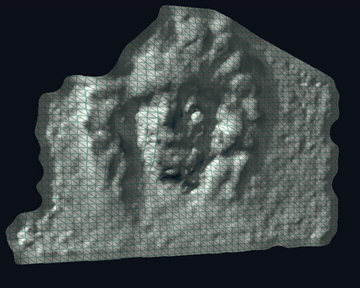

# Video-Content-3D-Model-Rebuilt-App
This repo is for the project of EN.520.665.01.FA22 Machine perception: recover camera motion and 3D
shape from a video with the Tomasi-Kanade factorization method, then build a dense 3D model.



## Steps
```bash
pip install -r requirements.txt
python main.py     # sparse structure from motion for both sequences: medusaplot.png, castleplot.png
python dense.py    # dense textured model of the Medusa head in results/ (needs ffmpeg for the clips)
```

## Objectives
1. Feature Point Tracking using trackers of teams’ choice.
2. Implement the Tomasi-Kanade factorization method for structure from motion for orthographic camera

## Features
1. Feature tracking: Shi-Tomasi corners followed through every frame with pyramidal Lucas-Kanade,
   a forward-backward check and RANSAC on the epipolar geometry of each frame pair. Only points seen
   in all frames are kept (2,275 for the 50 Medusa frames, 830 for the 28 castle frames).
2. Tomasi-Kanade factorization: rank-3 SVD of the registered measurement matrix, with metric
   constraints for scaled orthography so the camera may zoom or change distance.
3. Perspective refinement (`dense.py`): iterated factorization after Christy & Horaud (1996), with a
   search over the focal length. On frames 12-28 of the Medusa video this brings the mean
   reprojection error from 1.65 px (scaled orthography) to 0.45 px, and it settles the depth reversal
   that affine factorization leaves open.
4. Dense reconstruction (`dense.py`): DIS optical flow chained from a reference frame, every pixel
   triangulated with the recovered cameras over several baselines and kept where it reprojects
   within 1.5 px. The result is a textured mesh (`results/medusa_model.ply`), a depth image, a still
   and three clips drawn by a small numpy renderer (`render.py`): the textured model turning, the
   bare geometry, and the mesh being built from the tracked points (above).

## Fixes (October 2026)
The original sparse pipeline produced a near-random point cloud. Three causes:
1. Matches were stored with the query index (`kp_points[j][idz]`) instead of the matched keypoint
   (`trainIdx`), and the per-frame lists were then cut to a common length, so the columns of the
   measurement matrix mixed unrelated points. Tracking is now done with Lucas-Kanade tracks that
   follow one physical point through every frame.
2. The constraint `i_f . j_f = 0` used `g_builder(r1, r2)`, whose off-diagonal terms (`2 a_i b_j`)
   are only right when `a == b`. `g_builder` now uses `a_i b_j + a_j b_i`.
3. The unit-norm constraints of pure orthography do not hold while the Medusa camera zooms out;
   the metric constraints are now those of scaled orthography.

## Data
The Medusa head and castle sequences are from Marc Pollefeys et al., KU Leuven
("Visual Modeling with a Hand-Held Camera", IJCV 2004), provided as course data.
